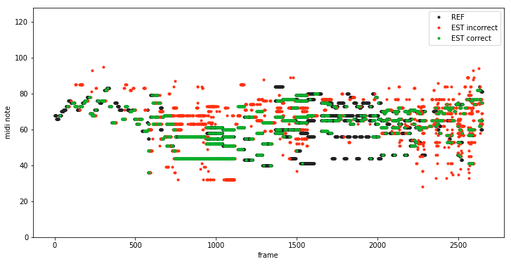

# Automatic Music Transcription

A small framework for conducting deep learning experiments for the [MIREX AME task](https://www.music-ir.org/mirex/wiki/2019:Audio_Melody_Extraction). The aim of this project is to create a set of utility functions and classes that make the experiments easier to implement and replicate. A sample set of experiments is included. The classes were implemented to be reusable for the [Multiple Fundamental Frequency Estimation Tracking task](https://www.music-ir.org/mirex/wiki/2019:Multiple_Fundamental_Frequency_Estimation_%26_Tracking).

<!--  -->

## Installation

### 1. Prepare the data

To replicate the experiments on the available MIREX datasets please:

- Download the evaluation datasets:
    - [ORCHSET](https://www.upf.edu/web/mtg/orchset)
    - [MIREX05 and ADC04](https://labrosa.ee.columbia.edu/projects/melody/) (links "adc2004_full_set.zip" and "Zip file of the LabROSA training data")
- Extract the contents to `./data/` directory.

For training we used [MedleyDB dataset](https://medleydb.weebly.com/) which is available after a permission request. MedleyDB is offered free of charge for non-commercial research use.
- After obtaining the dataset, extract it to `./data/` directory.

### 2. Prepare the pretrained models

Download the models and extract them to `models/` directory.
- CREPE inspired model
- WaveNet inspired model
- **HCNN model (no context)**
- **HCNN model (with context)**

### 3. Prepare the environment

You can either install the dependencies system-wide or use the included Anaconda environment file.

#### 3.b) Install the Anaconda environment (Recommended)

    conda env create -f environment.yml
    conda activate melody_extraction

Important: if you own a GPU compatible with Tensorflow, install `tensorflow-gpu`:

    conda install tensorflow-gpu

#### 3.a) Installing the dependencies using pip

    pip install -r requirements.txt

### 4. Run the evaluations

To evaluate the HCNN no-context model, run:

    python -u spectrogram.py --dataset adc04 mirex05 orchset --frame_width 256 --annotations_per_window 1 --spectrogram_undertone_stacking 8 --spectrogram_overtone_stacking 8 --filters 16 --stacks 8 --undertone_stacking 2 --overtone_stacking 3  --evaluate --logdir models/0513_173718-spctrgrm-bs16-fw256-apw1-ulw1.0-sus8-sos8-f16-s8-us2-os3/

### 5. Training

MedleyDB is required for training the models. Example training commands are included as comments in `run_evaluation_models.sh`. Also it should be noted, that running the training on a Tensorflow-compatible GPU is almost mandatory. Provided models were trained on NVIDIA GTX 1070.

## Disclaimer

This framework was created for use in my bachelor thesis. Since the focus of the thesis wasn't on the code but on the results of the experiments, this repository doesn't contain the best practices. Also with the release of Tensorflow r2 a part of the code is deprecated now and I am most probably not going to refactor it. Still a lot of the code might be useful to someone and the experiments are made to be easily replicable.

## Features
- Dataset handling
    - loading common AME datasets (MedleyDB, MDB-melody-synth, ORCHSET, ...)
        - Some AMT datasets are also supported (MDB-mf0-synth)
    - using training, validation and testing splits
    - audio preprocessing
        - audio file resampling
        - annotation resampling to different hop sizes
        - spectrogram generations
        - preprocessing operations are parallelized and all the results cached to the disk and automatically recomputed when the parameters change
    - simple manipulation of the audio and spectrograms for creating small evaluation excerpts (for qualitative analysis)
        - annotations of the excerpts are automatically matched to the full annotations
    - using datasets for training deep neural networks
        - overlapping windows, batching, shuffling
        - one example window can contain more annotation points
        - data filtering by voicing
        - data augmentation using [SpecAugment](https://arxiv.org/abs/1904.08779)

- Tensorflow model skeleton
    - the focus is on replicability of the experiments, all of the parameters of the experiments are visible in Tensorboard and a subset is also automatically added to the name of the experiment.
        - also the model function is saved alongside the experiment files
    - a set of common functions
        - input audio normalization
        - target annotation representation
            - one-hot or gaussian blurred output (as in [1])
    - training loop
        - periodic qualitative and quantitative evaluation, 
        - saving of the best models

- Evaluation
    - everything is logged to Tensorboard
        - images of the output salience and prediction
        - MIREX statistics

- Visualization
    - for use in Jupyter notebooks and in Tensorboard
    - colorful pianoroll with the reference and estimate annotation
    - confusion matrix
    - note prediction distance histogram

And more...

## Citations

> [1] Bittner, R. M., Mcfee, B., Salamon, J., Li, P., & Bello, J. P. (2017). Deep Salience Representations for F0 Estimation in Polyphonic Music. Ismir, 23–27. Retrieved from https://bmcfee.github.io/papers/ismir2017_salience.pdf